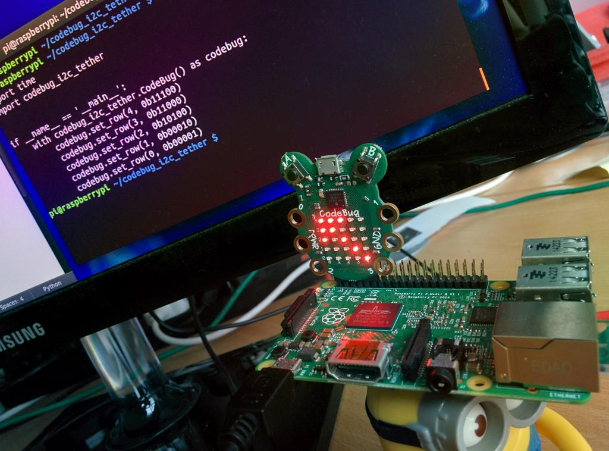

.. CodeBug I2C Tether documentation master file, created by
   sphinx-quickstart on Thu Jun 20 15:23:09 2013.
   You can adapt this file completely to your liking, but it should at least
   contain the root `toctree` directive.

Welcome to CodeBug I2C Tether's documentation!
==============================================

The `codebug_i2c_tether` Python module provides functions and classes for
interacting with CodeBug when tethered over I2C.

Links:
    - `CodeBug Website <http://www.codebug.org.uk/>`_
    - `GitHub <https://github.com/codebugtools/>`_

Contents:

.. toctree::
   :maxdepth: 2

   installation
   example

Indices and tables
==================

* :ref:`genindex`
* :ref:`modindex`
* :ref:`search`

