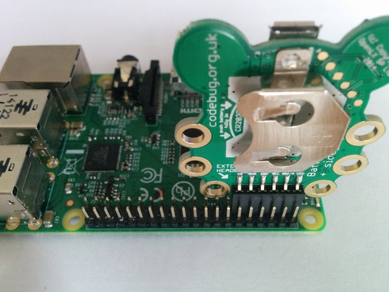

############
Installation
############
These instructions assume you're controlling CodeBug over I2C on a
Raspberry Pi. If you're using another type of machine then it is assumed
you know what you're doing and can set up I2C.

You can use the ``codebug_i2c_tether`` Python 3 API by either:

* Installing with ``apt-get``
* Installing with ``pip``
* Copying the ``codebug_i2c_tether`` module into your project directory.

Setting up CodeBug
------------------
In order to communicate with CodeBug over I2C you need to program CodeBug with
``codebug_i2c_tether.cbg`` (you can find this in the ``firmware/`` directory
of this project). To do this, plug in CodeBug via USB --- it should appear
as a USB drive --- then copy onto it the ``codebug_i2c_tether.cbg`` file.
CodeBug is now ready to be used via I2C.

Unplug CodeBug, remove the battery (if one) and then plug CodeBug's extension
header into the I2C GPIO pins on the Raspberry Pi. These are the left-most
inner row GPIO pins on the Raspberry Pi with CodeBug facing in.

Here is a diagram of this configuration::

    +-------------------------------------------------------+
    | oooooooooooooooooooooooooooooooooooooooo <- GPIO pins |
    | XXXXXXoooooooooooooooooooooooooooooooooo              |
    |    ^                                                  |
    |    |                                                  |
    | CodeBug                                               |
    |                                                       |
    |                                                       |
    |                             RPi                       |
    |                                                       |
    |                                                       |
    |                                                       |
    +-------------------------------------------------------+

And here is a picture of the same thing:

Setting up Raspberry Pi
-----------------------
First, make sure you have enabled I2C by running::

    sudo raspi-config

and then navigating to::

    Advanced Options > Would you like the I2C interface to be enabled? > Yes
    Would you like the I2C kernel module to be loaded by default? > Yes

Then reboot.

Installing with ``apt-get``
---------------------------
.. note:: ``apt-get`` installation is not ready yet.

Make sure you are using the lastest version of Raspbian::

    $ sudo apt-get update && sudo apt-get upgrade

Install ``codebug_i2c_tether`` for Python 3 with the following command::

    $ sudo apt-get install python3-codebug-i2c-tether

Installing with ``pip``
-----------------------
.. warning:: Do not install ``codebug_i2c_tether`` with both ``apt-get``
             and ``pip`` as unexpected things will happen. Consider using
             virtual environments.

Make sure ``pip`` is installed::

    sudo apt-get install python3-pip

Install ``codebug_i2c_tether`` using ``pip``::

    sudo pip-3.2 install codebug_i2c_tether

Installing with ``pip`` (with Virtual Environments)
---------------------------------------------------
.. note :: Generally, it's best to install packages into a
           `virtual environment <http://docs.python-guide.org/en/latest/dev/virtualenvs/>`_
           when using ``pip`` so that they remain project specific.

Install ``virtualenv``::

    sudo pip-3.2 install virtualenv

Move into your project and create the virtual environment::

    cd my_project_directory/
    virtualenv-3.2 venv

Activate the virtual environment::

    source venv/bin/activate

You should notice that your command prompt has changed. ``pip`` will now
install all packages into the virtual environment instead of littering
your system files::

    pip install codebug_i2c_tether

Now you can work on your application with ``codebug_i2c_tether``. Once
you're done, deactivate the virtual environment::

    deactivate

You will not be able to use packages installed in the virtual environment
until you activate it again (`source venv/bin/activate`).

Using ``codebug_i2c_tether`` without installing
-----------------------------------------------
You may want to use ``codebug_i2c_tether`` without installing anything at
all. You can just download and include the ``codebug_i2c_tether`` package
in your project and start using it. The quickest way to do this is::

    git clone https://github.com/codebugtools/codebug_i2c_tether.git
    cp -r codebug_i2c_tether/codebug_i2c_tether myproject/
    cd myproject/
    python3
    >>> import codebug_i2c_tether
